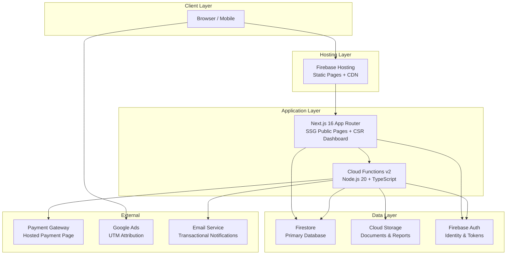
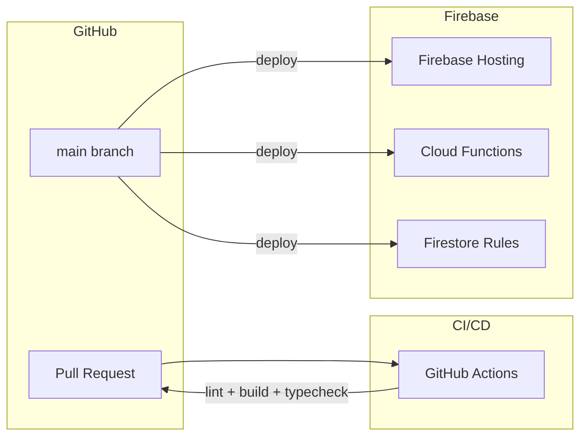
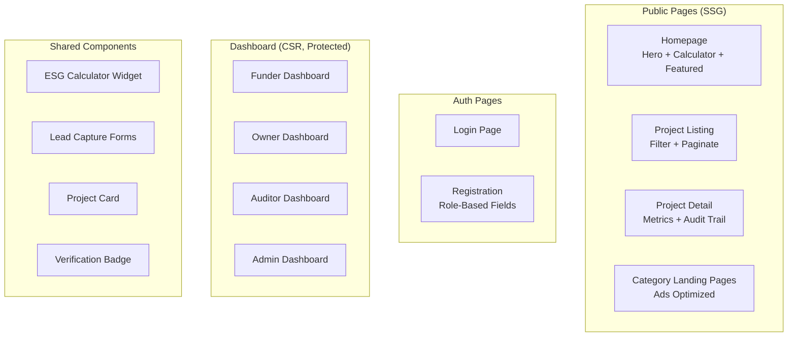
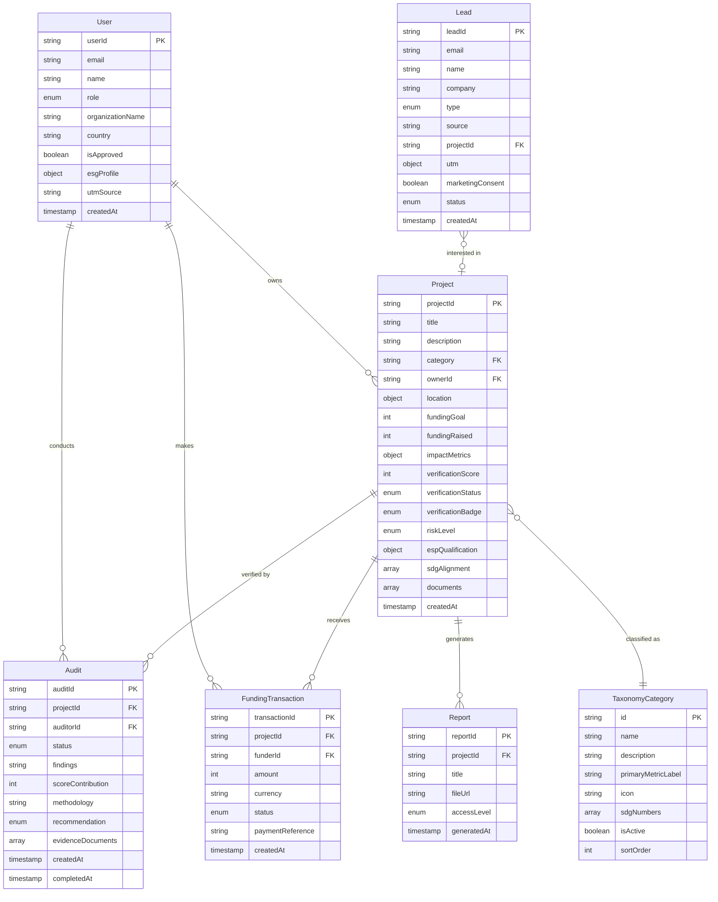

# Design Document: Offsettabillity Platform

## Overview

Offsettabillity is a verified ESG impact project funding platform with a lead generation focus, built on Next.js 16 (App Router) with a Firebase backend. The platform connects three primary actors — Project Owners, Funders, and Auditors — through a multi-tier verification system that builds trust and drives conversion.

The architecture prioritizes:
1. **Lead capture** — Every public page is optimized for conversion via Google Ads traffic
2. **Verification trust** — A transparent, auditable verification pipeline with tiered badges
3. **Zero-cost startup** — All services operate within GCP Always Free tier limits
4. **Role-based access** — Firestore Security Rules enforce permissions at the database level

### Key Design Decisions

| Decision | Choice | Rationale |
|----------|--------|-----------|
| Database | Firestore | Free tier, real-time sync, security rules for RBAC |
| Auth | Firebase Auth | Free tier, integrates with Firestore rules |
| API layer | Cloud Functions v2 (onCall + onRequest) | Serverless, free tier, TypeScript shared types |
| Frontend rendering | SSG for public pages, CSR for dashboard | LCP < 2.5s for ads traffic, dynamic for auth pages |
| Validation | Zod (shared schemas) | Single source of truth for FE + BE validation |
| Financial values | Integer cents (ZAR) | Avoids floating-point precision errors |
| File storage | Cloud Storage | 5 GB free, organized by entity path |

## Architecture

### High-Level System Architecture



### Request Flow Patterns

**Public Read (Project Browsing):**
```
Browser → Firebase Hosting → Next.js SSG Page → Firestore (client SDK, read-only)
```

**Authenticated Write (Project Creation):**
```
Browser → Firebase Auth (ID token) → Cloud Function (onCall) → Zod validation → Firestore write
```

**Lead Capture (Public, No Auth):**
```
Browser → Cloud Function (onRequest POST /api/leads) → Rate limit check → Honeypot check → Zod validation → Firestore write → Async notification
```

### Deployment Architecture



## Components and Interfaces

### Frontend Components



### Backend Services (Cloud Functions)

| Service | Type | Auth | Purpose |
|---------|------|------|---------|
| `leads_create` | onRequest (POST) | None | Public lead capture |
| `projects_create` | onCall | owner | Create new project |
| `projects_submit` | onCall | owner | Submit for verification |
| `projects_update` | onCall | owner | Update draft project |
| `audits_submit` | onCall | auditor | Submit audit findings |
| `funding_create` | onCall | funder | Record funding commitment |
| `admin_approveAuditor` | onCall | admin | Approve auditor account |
| `admin_assignAudit` | onCall | admin | Assign auditor to project |
| `admin_prescreenProject` | onCall | admin | Pre-screen submitted project |
| `leads_update` | onCall | admin | Update lead status/notes |
| `taxonomy_create` | onCall | admin | Create taxonomy category |
| `taxonomy_update` | onCall | admin | Update taxonomy category |
| `reports_generate` | onCall | funder/admin | Generate impact report PDF |

### Interface Contracts

#### Lead Capture (Critical Path)

```typescript
// POST /api/leads — Public, no auth
// Must respond within 200ms

interface LeadCreateRequest {
  email: string;              // Required, RFC 5322
  name?: string;              // Max 100 chars
  company?: string;           // Max 200 chars
  phone?: string;             // Max 20 chars
  type: LeadType;             // Required: calculator | report_request | consultation | newsletter | auditor_inquiry
  source: string;             // Page URL
  projectId?: string;
  message?: string;
  industry?: string;          // From calculator
  budget?: number;            // From calculator (ZAR)
  marketingConsent: boolean;  // Explicit consent checkbox
  utm: {
    source?: string;
    medium?: string;
    campaign?: string;
    content?: string;
    term?: string;
  };
}

interface LeadCreateResponse {
  success: true;
  data: { leadId: string };
}
```

#### Project Creation

```typescript
// onCall: projects_create — Requires owner role

interface ProjectCreateRequest {
  title: string;              // Max 120 chars
  description: string;        // Max 5000 chars
  category: string;           // Must match active taxonomy ID
  subCategory?: string;
  location: {
    lat: number;
    lng: number;
    address: string;
    country: string;          // ISO 3166-1 alpha-2
  };
  fundingGoal: number;        // Integer cents, 1000–999999999
  impactMetrics: {
    reportingPeriod: 'Monthly' | 'Quarterly' | 'Annually' | 'Project Duration';
    primaryMetric: {
      label: string;          // From taxonomy
      value: number;
    };
  };
}
```

#### Audit Submission

```typescript
// onCall: audits_submit — Requires auditor role, must be assigned

interface AuditSubmitRequest {
  auditId: string;
  findings: string;
  scoreContribution: number;  // 0–100
  methodology: string;
  recommendation: 'approve' | 'conditional' | 'reject';
  evidenceDocuments?: string[]; // Cloud Storage paths
}
```

#### Funding Commitment

```typescript
// onCall: funding_create — Requires funder role

interface FundingCreateRequest {
  projectId: string;
  amount: number;             // Integer cents, 1000–100000000
  currency?: string;          // Default: ZAR
}
```

### Verification Score Calculation

```typescript
function calculateVerificationScore(project: Project, audits: Audit[]): number {
  const weights = {
    documentationCompleteness: 0.20,
    auditorAssessment: 0.40,
    impactMethodology: 0.20,
    reportingCompliance: 0.20,
  };

  const docScore = calculateDocumentationScore(project);
  const auditScore = calculateAuditScore(audits);
  const methodologyScore = calculateMethodologyScore(audits);
  const complianceScore = calculateComplianceScore(project);

  return Math.round(
    docScore * weights.documentationCompleteness +
    auditScore * weights.auditorAssessment +
    methodologyScore * weights.impactMethodology +
    complianceScore * weights.reportingCompliance
  );
}
```

### Badge Assignment Logic

```typescript
function determineBadge(score: number, completedAudits: number): VerificationBadge {
  if (completedAudits >= 3 && score > 95) return 'Premium Assured';
  if (completedAudits >= 2 && score > 85) return 'Verified+';
  if (completedAudits >= 1) return 'Verified';
  return 'None';
}
```

## Data Models

### Firestore Collection Structure



### Firestore Security Rules Structure

```
rules_version = '2';
service cloud.firestore {
  match /databases/{database}/documents {

    // Users: read own, admin reads all
    match /users/{userId} {
      allow read: if request.auth.uid == userId || isAdmin();
      allow write: if request.auth.uid == userId;
    }

    // Projects: public read for verified+, owner write for drafts
    match /projects/{projectId} {
      allow read: if isPublicProject() || isOwner() || isAdmin();
      allow create: if isOwner();
      allow update: if (isOwner() && isDraft()) || isAdmin();
    }

    // Audits: assigned auditor + admin
    match /audits/{auditId} {
      allow read: if isAssignedAuditor() || isProjectOwner() || isAdmin();
      allow create: if isAdmin();
      allow update: if isAssignedAuditor() || isAdmin();
    }

    // Leads: admin only
    match /leads/{leadId} {
      allow read, write: if isAdmin();
      // Public writes go through Cloud Function
    }

    // Taxonomy: public read, admin write
    match /taxonomy/{categoryId} {
      allow read: if true;
      allow write: if isAdmin();
    }

    // Funding: funder creates, admin manages
    match /funding/{transactionId} {
      allow read: if isFunder() || isProjectOwner() || isAdmin();
      allow create: if isFunder();
      allow update: if isAdmin();
    }

    // Reports: access-level based
    match /reports/{reportId} {
      allow read: if isPublicReport() || isGatedReport() || isFunder() || isAdmin();
      allow write: if isAdmin();
    }
  }
}
```

### Shared Zod Schemas (Validation)

```typescript
// shared/schemas.ts — Used by both frontend and Cloud Functions

import { z } from 'zod';

export const LeadCreateSchema = z.object({
  email: z.string().email().max(254),
  name: z.string().max(100).optional(),
  company: z.string().max(200).optional(),
  phone: z.string().max(20).optional(),
  type: z.enum(['calculator', 'report_request', 'consultation', 'newsletter', 'auditor_inquiry']),
  source: z.string().url(),
  projectId: z.string().optional(),
  message: z.string().optional(),
  industry: z.string().optional(),
  budget: z.number().min(1).max(999999999).optional(),
  marketingConsent: z.boolean(),
  utm: z.object({
    source: z.string().optional(),
    medium: z.string().optional(),
    campaign: z.string().optional(),
    content: z.string().optional(),
    term: z.string().optional(),
  }),
});

export const ProjectCreateSchema = z.object({
  title: z.string().min(1).max(120),
  description: z.string().min(1).max(5000),
  category: z.string().min(1).max(50),
  subCategory: z.string().optional(),
  location: z.object({
    lat: z.number().min(-90).max(90),
    lng: z.number().min(-180).max(180),
    address: z.string().min(1),
    country: z.string().length(2),
  }),
  fundingGoal: z.number().int().min(1000).max(999999999),
  impactMetrics: z.object({
    reportingPeriod: z.enum(['Monthly', 'Quarterly', 'Annually', 'Project Duration']),
    primaryMetric: z.object({
      label: z.string().min(1),
      value: z.number(),
    }),
  }),
});

export const AuditSubmitSchema = z.object({
  auditId: z.string().min(1),
  findings: z.string().min(1),
  scoreContribution: z.number().int().min(0).max(100),
  methodology: z.string().min(1),
  recommendation: z.enum(['approve', 'conditional', 'reject']),
  evidenceDocuments: z.array(z.string()).optional(),
});

export const FundingCreateSchema = z.object({
  projectId: z.string().min(1),
  amount: z.number().int().min(1000).max(100000000),
  currency: z.string().length(3).default('ZAR'),
});

export const RegistrationSchema = z.object({
  email: z.string().email(),
  password: z.string().min(8).max(64).regex(
    /^(?=.*[a-z])(?=.*[A-Z])(?=.*\d)/,
    'Password must contain uppercase, lowercase, and digit'
  ),
  name: z.string().min(1).max(100),
  country: z.string().length(2),
  role: z.enum(['funder', 'owner', 'auditor']),
  // Role-specific fields
  organizationName: z.string().optional(),
  organizationType: z.string().optional(),
  organizationRegNumber: z.string().optional(),
  industry: z.string().optional(),
  areasOfInterest: z.array(z.string()).optional(),
  qualifications: z.string().optional(),
  yearsOfExperience: z.number().int().min(0).optional(),
  specializations: z.array(z.string()).optional(),
});

export const TaxonomyCategorySchema = z.object({
  id: z.string().regex(/^[a-z0-9-]+$/).max(50),
  name: z.string().min(1).max(80),
  description: z.string().max(500).optional(),
  primaryMetricLabel: z.string().min(1),
  icon: z.string().optional(),
  sdgNumbers: z.array(z.number().int().min(1).max(17)).optional(),
  isActive: z.boolean().default(true),
  sortOrder: z.number().int().min(0).max(999).default(0),
});
```

### UTM Session Persistence

UTM parameters from Google Ads are captured on landing and persisted for the browser session:

```typescript
// lib/hooks/useUtmCapture.ts
function useUtmCapture() {
  useEffect(() => {
    const params = new URLSearchParams(window.location.search);
    const utm = {
      source: params.get('utm_source'),
      medium: params.get('utm_medium'),
      campaign: params.get('utm_campaign'),
      content: params.get('utm_content'),
      term: params.get('utm_term'),
    };
    if (Object.values(utm).some(Boolean)) {
      sessionStorage.setItem('utm_params', JSON.stringify(utm));
    }
  }, []);
}
```


## Correctness Properties

*A property is a characteristic or behavior that should hold true across all valid executions of a system — essentially, a formal statement about what the system should do. Properties serve as the bridge between human-readable specifications and machine-verifiable correctness guarantees.*

### Property 1: Registration validation and user document creation

*For any* registration input, if all fields pass validation (valid email, password with uppercase+lowercase+digit of 8–64 chars, name 1–100 chars, valid ISO 3166-1 alpha-2 country, valid role, and role-specific required fields), the system SHALL create a user document with the correct role, all provided fields, and role-specific fields stored correctly. If any field fails validation, the system SHALL reject the registration and return field-specific error messages without creating any account.

**Validates: Requirements 1.1, 1.2, 1.3, 1.4, 1.7**

### Property 2: Auditor approval gate

*For any* auditor user where isApproved is false, the system SHALL deny access to audit browsing and audit application endpoints, regardless of the auditor's other attributes.

**Validates: Requirements 1.5**

### Property 3: UTM parameter preservation on registration

*For any* successful registration where UTM parameters (source, medium, campaign) are present in the session, the system SHALL store those UTM values in the user document alongside the user's profile data.

**Validates: Requirements 1.8**

### Property 4: Orphaned auth account cleanup

*For any* registration attempt where the Firebase Auth account is created but the Firestore document write fails, the system SHALL delete the orphaned Auth account, ensuring no auth account exists without a corresponding Firestore document.

**Validates: Requirements 1.9**

### Property 5: Project creation invariants

*For any* valid project creation input (title ≤120 chars, description ≤5000 chars, category from active taxonomy, valid location, fundingGoal 1000–999999999 cents, valid impact metrics), the created project SHALL have verificationStatus="draft", verificationBadge="None", and fundingRaised=0. For any input violating these constraints, creation SHALL be rejected with field-specific validation errors.

**Validates: Requirements 2.1, 2.2, 2.8**

### Property 6: Project edit permissions by status

*For any* project, if its verificationStatus is "draft" then all fields SHALL be editable. If its verificationStatus is any value other than "draft", then title, category, and fundingGoal SHALL be immutable (edit attempts rejected), while other fields remain editable by the owner.

**Validates: Requirements 2.4, 2.5**

### Property 7: Document upload validation

*For any* file upload attempt on a project, the system SHALL accept the file if and only if: the file type is PDF, PNG, or JPEG; the file size is ≤ 5 MB; and the project has fewer than 10 existing documents. A failed upload SHALL NOT modify the project's existing document list.

**Validates: Requirements 2.6, 2.9**

### Property 8: Project status transition on submission

*For any* project in "draft" status with at least one supporting document, submitting for verification SHALL transition the status to "submitted". For any project without documents, submission SHALL be rejected.

**Validates: Requirements 2.3, 2.7**

### Property 9: Taxonomy category uniqueness and validation

*For any* taxonomy category creation request, the system SHALL accept it if and only if: the ID is unique among all categories (active and inactive), the ID matches the pattern `[a-z0-9-]` with max 50 chars, the display name is provided and ≤ 80 chars, and the primary metric label is provided. Duplicate IDs SHALL be rejected.

**Validates: Requirements 3.1, 3.2, 3.3**

### Property 10: Category deactivation preserves existing projects

*For any* deactivated category, new projects SHALL NOT be able to select that category, but all existing projects assigned to that category SHALL continue to display the category name and metric label unchanged.

**Validates: Requirements 3.4**

### Property 11: Verification badge determination

*For any* project with a set of completed audits, the verification badge SHALL be determined as follows: if the project has 3+ completed audits with "approve" recommendation and a verification score > 95, the badge is "Premium Assured"; else if 2+ completed audits and score > 85, the badge is "Verified+"; else if 1+ completed audit with "approve" recommendation, the badge is "Verified"; otherwise the badge is "None".

**Validates: Requirements 4.4, 4.5, 4.6**

### Property 12: Verification score weighted calculation

*For any* set of audit data and project documentation state, the verification score SHALL equal the weighted sum: documentationCompleteness × 0.20 + auditorAssessment × 0.40 + impactMethodology × 0.20 + reportingCompliance × 0.20, rounded to the nearest integer in the range 0–100.

**Validates: Requirements 4.8**

### Property 13: Auditor conflict of interest prevention

*For any* auditor-project pair where the auditor owns the project, has funded it, or has audited it in the previous cycle, the system SHALL reject the audit assignment.

**Validates: Requirements 4.7**

### Property 14: Audit submission completes audit and recalculates score

*For any* audit in "pending" or "in_progress" status, when the assigned auditor submits valid findings (score 0–100, methodology, recommendation), the audit status SHALL transition to "completed" and the project's verification score SHALL be recalculated.

**Validates: Requirements 4.3**

### Property 15: Funding eligibility enforcement

*For any* funding commitment attempt, the system SHALL accept it if and only if: the project has verificationStatus "verified" or "live", the funder is authenticated with role "funder", and the amount is between 1000 and 100000000 cents inclusive. All other attempts SHALL be rejected with an appropriate error.

**Validates: Requirements 5.1, 5.2**

### Property 16: Payment confirmation effects on fundingRaised

*For any* funding transaction, if the payment gateway confirms the payment, the project's fundingRaised SHALL increase by exactly the confirmed amount (in integer cents). If the payment fails, the project's fundingRaised SHALL remain unchanged.

**Validates: Requirements 5.4, 5.5**

### Property 17: Funding goal threshold triggers status transition

*For any* project where a confirmed payment causes fundingRaised to equal or exceed fundingGoal, the project status SHALL transition to "funded", regardless of whether the payment causes overfunding.

**Validates: Requirements 5.6, 5.9**

### Property 18: Funding concentration notification

*For any* single funder whose cumulative confirmed funding exceeds 50% of a project's fundingGoal, the system SHALL trigger an admin notification for manual review.

**Validates: Requirements 5.8**

### Property 19: Lead capture validation and storage

*For any* lead submission, if the email is valid (RFC 5322, max 254 chars) and lead type is provided, the system SHALL create a lead record with status="new", all provided fields stored correctly (including UTM parameters, marketing consent, and timestamp), and trigger an async admin notification. If email is invalid or type is missing, the submission SHALL be rejected with field-specific errors.

**Validates: Requirements 6.1, 6.3, 6.7, 6.8**

### Property 20: Lead status transitions

*For any* lead status update by an admin, the system SHALL accept only transitions to the values: new, contacted, qualified, converted, or lost. Invalid status values SHALL be rejected.

**Validates: Requirements 6.4**

### Property 21: Marketing consent enforcement

*For any* lead where marketingConsent is false, the system SHALL NOT send marketing communications to that lead's email address, while still storing the lead for transactional purposes.

**Validates: Requirements 6.9, 12.5**

### Property 22: Duplicate lead creation

*For any* lead submission with an email and type matching an existing lead record, the system SHALL create a new separate lead record rather than rejecting or updating the existing one.

**Validates: Requirements 6.10**

### Property 23: Rate limiting on lead capture

*For any* IP address that has submitted more than 5 lead requests within a 60-second sliding window, subsequent submissions from that IP SHALL be rejected with a RATE_LIMITED error until the window expires.

**Validates: Requirements 6.11, 13.6, 13.7**

### Property 24: ESG calculator allocation output

*For any* valid industry selection and budget value (R1 to R999,999,999), the ESG calculator SHALL produce an allocation result containing: a total recommended spend equal to the input budget, and percentage breakdowns across at least 3 active project categories that sum to 100%.

**Validates: Requirements 7.1, 7.2**

### Property 25: Calculator input validation

*For any* calculator submission with an empty industry selection or a budget value outside the range R1–R999,999,999, the system SHALL display inline validation errors and NOT produce an allocation result.

**Validates: Requirements 7.6**

### Property 26: Public project listing status filter

*For any* set of projects in the database, the public listing SHALL display only projects with verificationStatus "verified", "live", or "funded", sorted by most recently verified first. Projects with any other status SHALL NOT appear in public listings.

**Validates: Requirements 8.1**

### Property 27: Category filter correctness

*For any* category filter applied to the public project listing, all returned projects SHALL have a category matching the selected filter. No projects from other categories SHALL be included.

**Validates: Requirements 8.2**

### Property 28: Project card required fields

*For any* project displayed as a card in listings, the rendered output SHALL include: title, category name, verification badge, funding progress (raised vs goal), primary impact metric (label and value), and location country.

**Validates: Requirements 8.4**

### Property 29: Report content completeness

*For any* generated impact report, the output SHALL contain: project title, category, location, funding goal, funding raised, verification badge, verification score, full audit trail (each audit's findings, score contribution, recommendation, methodology, completedAt), impact metrics, ESP qualification details, and SDG alignment.

**Validates: Requirements 9.1, 9.4, 9.5**

### Property 30: Report access level enforcement

*For any* report with accessLevel "public", all users (including unauthenticated) SHALL have access. For accessLevel "gated", access SHALL require email submission and lead capture. For accessLevel "private", only the funding funder and admin roles SHALL have access.

**Validates: Requirements 9.2, 9.3**

### Property 31: Category landing page existence

*For any* active taxonomy category, a statically generated landing page SHALL exist at `/categories/{category-id}`. For any inactive or nonexistent category ID, the system SHALL return a 404 response.

**Validates: Requirements 10.1, 10.8**

### Property 32: UTM session persistence and attachment

*For any* visitor arriving with UTM parameters in the URL, those parameters SHALL be persisted for the browser session duration and attached to any subsequent lead capture or registration event within that session.

**Validates: Requirements 10.4**

### Property 33: Role-based dashboard data — Funder

*For any* authenticated funder, the dashboard SHALL display: their funded projects (up to 25, paginated), total impact contribution as sum of confirmed funding amounts in ZAR cents, and up to 10 verified projects matching their ESG profile interests that they have not yet funded.

**Validates: Requirements 11.1**

### Property 34: Role-based dashboard data — Owner

*For any* authenticated project owner, the dashboard SHALL display: their projects with current verification status and badge, funding progress as percentage of goal, and pending actions (drafts needing submission, submitted projects awaiting pre-screening, projects with unresolved audit findings).

**Validates: Requirements 11.2**

### Property 35: Role-based dashboard data — Auditor

*For any* authenticated approved auditor, the dashboard SHALL display: assigned audits with status pending/in_progress, available projects matching their specializations with no conflict of interest, and completed audits (up to 25, paginated).

**Validates: Requirements 11.3**

### Property 36: Role-based navigation restriction

*For any* authenticated user, the dashboard navigation SHALL display only items permitted by their role as defined in the access control matrix. No navigation items for unauthorized capabilities SHALL be visible.

**Validates: Requirements 11.5**

### Property 37: PII anonymization on account deletion

*For any* user requesting account deletion, the system SHALL replace all PII fields (email, name, phone) in their Firestore document with anonymized placeholders within 30 days, while retaining non-PII data for platform integrity.

**Validates: Requirements 12.2**

### Property 38: Role-based access control enforcement

*For any* Firestore operation on a protected collection, the system SHALL: reject unauthenticated requests with UNAUTHENTICATED error; reject authenticated requests from users whose role does not have permission (per the access control matrix) with PERMISSION_DENIED error; and permit requests only when the user's role grants access to the requested operation on the requested resource.

**Validates: Requirements 13.1, 13.2, 13.3**

### Property 39: Token validation on callable endpoints

*For any* request to a Cloud Function callable endpoint with an expired or malformed Firebase ID token, the system SHALL reject the request with an UNAUTHENTICATED error without processing the request body.

**Validates: Requirements 13.4, 13.5**

### Property 40: Honeypot bot detection

*For any* lead form submission where the hidden honeypot field contains a non-empty value, the system SHALL silently discard the submission without storing a lead record or triggering notifications.

**Validates: Requirements 13.8**

## Error Handling

### Error Response Format

All errors follow a consistent envelope structure:

```typescript
interface ErrorResponse {
  success: false;
  error: {
    code: ErrorCode;
    message: string;
    fields?: Record<string, string>; // Field-specific validation errors
  };
}

type ErrorCode =
  | 'VALIDATION_ERROR'
  | 'UNAUTHENTICATED'
  | 'PERMISSION_DENIED'
  | 'NOT_FOUND'
  | 'ALREADY_EXISTS'
  | 'RATE_LIMITED'
  | 'INTERNAL';
```

### Error Handling by Layer

| Layer | Error Type | Handling Strategy |
|-------|-----------|-------------------|
| Frontend (forms) | Validation | Inline errors below fields, preserve input, disable submit during request |
| Frontend (data fetch) | Network/server | Inline error with retry action per dashboard section |
| Cloud Functions | Input validation | Return VALIDATION_ERROR with field-specific messages |
| Cloud Functions | Auth failure | Return UNAUTHENTICATED, no data leakage |
| Cloud Functions | Permission | Return PERMISSION_DENIED, no data leakage |
| Cloud Functions | Rate limit | Return RATE_LIMITED with retry-after hint |
| Cloud Functions | Internal | Log error (excluding PII), return generic INTERNAL message |
| Firestore Rules | Auth/permission | Reject silently at database level |

### Critical Error Scenarios

1. **Registration rollback** (Req 1.9): If Firestore write fails after Auth account creation, delete the orphaned Auth account and prompt retry.

2. **Payment gateway failure** (Req 5.5): Mark transaction as "failed", do NOT modify fundingRaised. Display user-friendly error with retry option.

3. **Report generation failure** (Req 9.6): Never produce partial reports. Display error with failure reason. Log for admin investigation.

4. **Document upload failure** (Req 2.9): Retain all previously uploaded documents unchanged. Display specific failure reason (type, size, or storage error).

5. **Lead capture under load**: Prioritize fast response (< 200ms). Defer notification delivery to async processing. If Firestore write fails, return error but do not retry automatically (user can resubmit).

### Retry Strategy

| Operation | Retryable | Strategy |
|-----------|-----------|----------|
| Lead capture | Yes (user) | Show error, user resubmits |
| Funding payment | Yes (user) | Show error with retry button |
| Report generation | Yes (user) | Show error with retry button |
| Document upload | Yes (user) | Show error, user re-uploads |
| Dashboard data fetch | Yes (auto) | Inline retry button per section |
| Auth token refresh | Yes (auto) | Firebase SDK handles automatically |

## Testing Strategy

### Testing Approach

This platform uses a dual testing strategy combining property-based tests for universal correctness guarantees with example-based unit tests for specific scenarios and edge cases.

### Property-Based Testing

**Library:** [fast-check](https://github.com/dubzzz/fast-check) (TypeScript, integrates with Jest/Vitest)

**Configuration:**
- Minimum 100 iterations per property test
- Each test tagged with: `Feature: offsettabillity-platform, Property {number}: {property_text}`
- Tests run against mocked Firebase services (no real cloud calls)

**Properties to implement:**

| Property | Target Module | Key Generators |
|----------|--------------|----------------|
| 1: Registration validation | `functions/auth` | Valid/invalid registration inputs across all roles |
| 5: Project creation invariants | `functions/projects` | Valid/invalid project inputs |
| 6: Edit permissions by status | `functions/projects` | Projects in various statuses + edit attempts |
| 7: Document upload validation | `functions/projects` | Random file metadata (type, size, count) |
| 9: Taxonomy uniqueness | `functions/taxonomy` | Random category inputs with duplicate IDs |
| 11: Badge determination | `lib/verification` | Random audit counts and scores |
| 12: Score calculation | `lib/verification` | Random component scores |
| 13: Conflict of interest | `functions/audits` | Random auditor-project relationship pairs |
| 15: Funding eligibility | `functions/funding` | Random projects (various statuses) + amounts |
| 16: Payment effects | `functions/funding` | Random confirmed/failed payments |
| 17: Funding threshold | `functions/funding` | Random projects near funding goal |
| 19: Lead validation | `functions/leads` | Random valid/invalid lead inputs |
| 23: Rate limiting | `functions/leads` | Random IP sequences with timestamps |
| 24: Calculator allocation | `lib/calculator` | Random industry + budget combinations |
| 26: Public listing filter | `lib/projects` | Random projects with various statuses |
| 27: Category filter | `lib/projects` | Random projects across categories |
| 38: RBAC enforcement | `firestore.rules` | Random role + resource + operation combinations |
| 40: Honeypot detection | `functions/leads` | Random submissions with/without honeypot values |

### Unit Tests (Example-Based)

**Framework:** Jest + React Testing Library (frontend), Jest (functions)

**Focus areas:**
- Specific registration flows per role (1.2, 1.3, 1.4)
- Duplicate email handling (1.6)
- Empty state UI rendering (8.3, 8.6, 11.7)
- Cookie consent banner behavior (12.1, 12.7)
- Loading/error states (11.6, 11.8)
- Gated report email capture flow (9.3)
- Calculator email gate interaction (7.3)
- Landing page element presence (10.2, 10.5)

### Integration Tests

**Framework:** Playwright (E2E), Firebase Emulator Suite

**Critical paths:**
1. Full registration → login → dashboard flow (all roles)
2. Project creation → submission → pre-screen → audit → verification → funding
3. Lead capture from calculator → admin notification → lead management
4. Google Ads landing → UTM capture → lead form → attribution stored
5. Report generation → access level enforcement

### Performance Tests

- LCP < 2.5s on public pages (Lighthouse CI)
- Lead capture response < 200ms (load test against emulator)
- Report generation < 30s

### Security Tests

- Firestore rules unit tests (firebase-rules-unit-testing)
- Token validation on all callable endpoints
- Rate limiting verification
- Honeypot field enforcement
- PII exclusion from logs (log output inspection)

### Test Organization

```
tests/
├── properties/           # Property-based tests (fast-check)
│   ├── registration.property.test.ts
│   ├── projects.property.test.ts
│   ├── verification.property.test.ts
│   ├── funding.property.test.ts
│   ├── leads.property.test.ts
│   ├── calculator.property.test.ts
│   ├── access-control.property.test.ts
│   └── generators/      # Shared test data generators
│       ├── users.gen.ts
│       ├── projects.gen.ts
│       ├── audits.gen.ts
│       └── leads.gen.ts
├── unit/                 # Example-based unit tests
│   ├── components/
│   ├── functions/
│   └── lib/
├── integration/          # E2E with Playwright
│   ├── registration.spec.ts
│   ├── project-lifecycle.spec.ts
│   ├── lead-capture.spec.ts
│   └── funding.spec.ts
└── security/             # Firestore rules tests
    └── rules.test.ts
```
